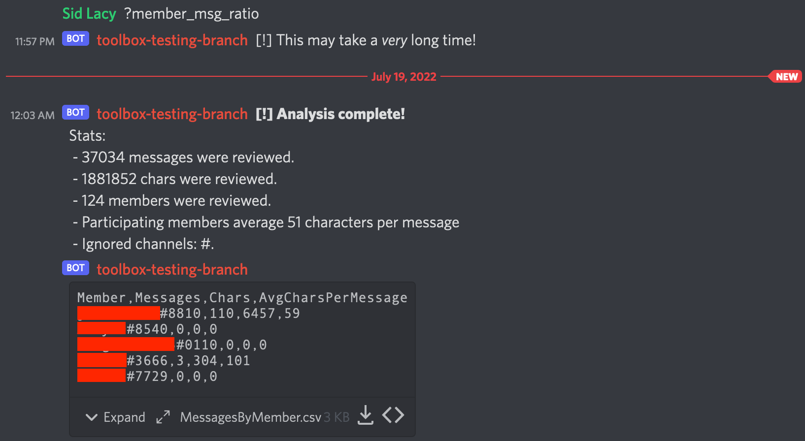
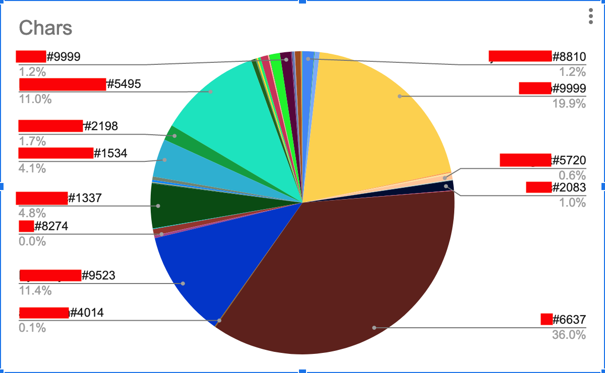

# DiscordMessageRatio

Which members of your Discord server contribute the most? Currently, this script iterates through every message in a given Discord server and calculates the following:

 - Total messages per user
 - Total characters per user
 - Total messages server-wide
 - Total characters server-wide
 - Average characters per message by user
 - Average characters per message of participating users server-wide (at least one message sent)
 - How many users were analyzed

Some of this information is expressed in a CSV for graphing and storage purposes, with the following headers: `Member, Messages, Chars, AvgCharsPerMessage`.

As shown, the data in the CSV may be modeled with Pandas/Matplotlib, Google Sheets, Microsoft Excel, etc.

## Requirements

 - Python 3, including the `discord` PIP package (`pip3 install discord`)
 - A Discord bot API token; the bot must have the following permissions in your server:
     - Server Members Intent
     - Message Content Intent
     - Read message history for every non-ignored channel (see *Usage*)

## Usage

1. `$ git clone https://github.com/lacysw/DiscordMessageRatio.git && cd DiscordMessageRatio`
2. `$ echo $YOUR_BOT_TOKEN > token.txt`
3. If desired, the following global variables can be modified at the top of `discord_message_ratio.py`:
     - `IGNORE = []`: put channels to ignore here as a list (e.g. `IGNORE = ['private', 'do-not-scan']`)
     - `MAX_DEPTH = 1000000`: maximum depth to search for messages; once this value is reached, any older messages will be skipped and the next channel will be scanned

## Important Disclaimer
Discord does not expose an official API function to calculate the values this script retrieves. Thus, the calculation is done manually by iterating over every single message using `channel.history`. This means that the number of requests made to Discord's servers can approach very large values, scaling 1:1 with the number of messages sent in your server. Discord will begin rate limiting requests after some time, and what's more, the request-response time can vary drastically. The limiting factor in terms of speed for this script is controlled entirely by Discord.
